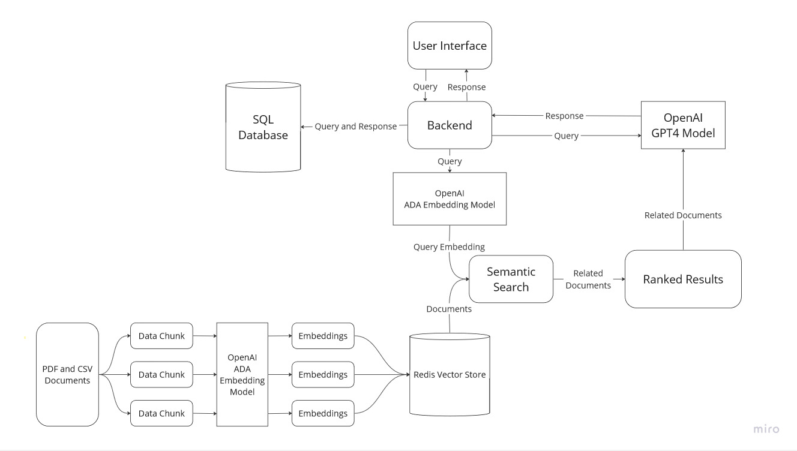

# CMPE 273 Hackathon

## Project Architecture




## Getting Started
### Prerequisites: 
NodeJS & NPM - Install Guides can be found [official Node.js website](https://nodejs.org/)
Docker - Install Guides can be found [official Docker website](https://www.docker.com/get-started/)

### Start Backend
Add your OPEN AI API key to the docker compose file, then run
```
docker compose up
```

### Start Frontend
```
cd chat-frontend
npm install
npm start
```
